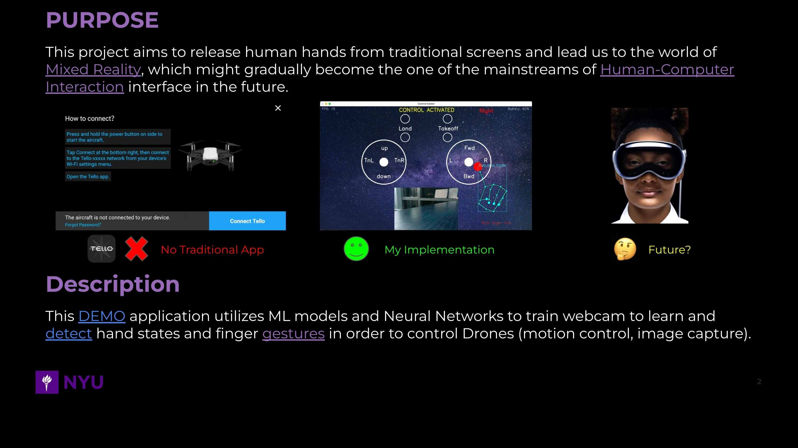
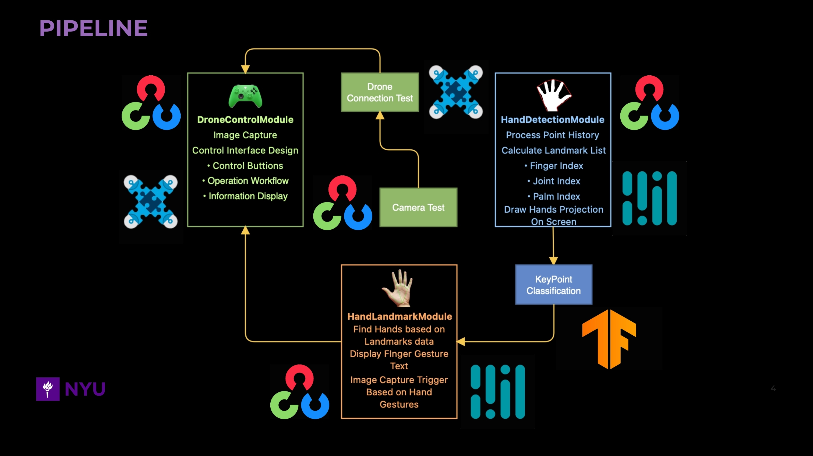
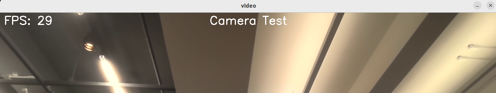
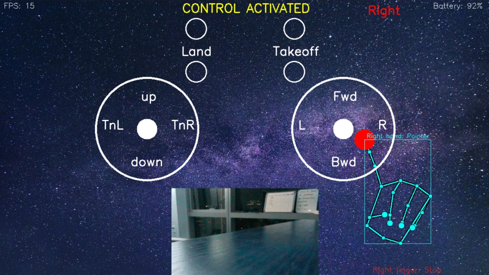

<p align="center">
    
</p>

## HandGestureDJITello

This tutorial teaches you how to navigate to the reseources and basic setup of the project.

## Pipeline Intro

<p align="center">
    
</p>

## Setup

1. **Clone the repository**: 
    ```bash
    git clone https://github.com/RayChen666/HandGestureDJITello.git
    ```
2. **Navigate to the project folder**:
    ```bash
    cd HandGestureDJITello
    ```
3. **Run the main control panel in root folder terminal**:
    ```bash
    python3 main.py
    ```
    The webcam will be activated so that user can test with the interactive environement with FPS counter displayed on the left corner of the camera feed. (better effect if FPS close to 30)

    <p align="center">
        
    </p>
4. **Hot key control**: 
    press "c" to close webcam without quiting the program; press "o" to reopen camera; press "g" to start/stop grayscale; press "q" to quit the program; press "d" to activate drone control panel, and the program will run DJI Tello wifi protocol connection test automatically. If the test passed, the control panel will be activated. 
    <p align="center">
        
    </p>
    Place both of your left and right hand pointer (green for left, red for right) inside 2 circles on the top, the text on top will show "Control Activated" and the full control pads will show up. The panel contains FPS counter on the top left corner and the drone battery counter on the top right corner. (if the batter is lower than 20%, the program will automatically force the drone to land for safety reason)

## Control & Play
1. **Takeoff/Land**: Put your finger pointer (either) into the Takeoff circle to let the drone takeoff. Place your finger pointer into the Land circle to let the drone land.
2. **Navigation**: Move your finger pointer along side the control pads to move drone up (up), down (down), left (L), right (R), forward (Fwd), and backward (Bwd). Turn the drone left (TnL) and right (TnR).
3. **Special Gesture**: Since this program utilize pre-trained hand index ML model, I pre-loaded some hand gesture and mapped with certain drone action (For example, gesture of "OK" sign to let drone take picture with its own camera).
